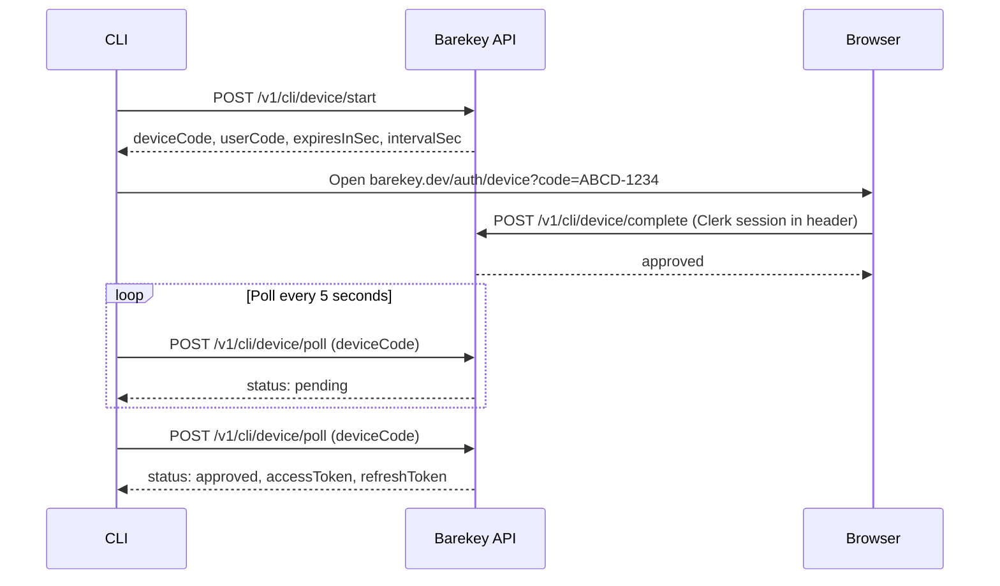

The CLI authenticates through a browser-based device authorization flow. The CLI never handles your Clerk credentials — instead, you approve the device in the browser, and the CLI receives a token pair on its next poll.

## Flow overview



The device code expires after **10 minutes**. If not approved within that window, the next poll returns `DEVICE_CODE_EXPIRED`.

---

## POST /v1/cli/device/start

Start a new device authorization flow. Does not require an `Authorization` header.

### Request

```bash
curl -X POST https://api.barekey.dev/v1/cli/device/start \
  -H "Content-Type: application/json" \
  -d '{
    "clientName": "Barekey CLI v1.0.0"
  }'
```

**Request body fields:**

| Field | Type | Required | Description |
|---|---|---|---|
| `clientName` | `string` | No | Human-readable name of the client. Shown in the browser during approval. |

### Response

```json
{
  "deviceCode": "bk_dc_8f3kLmNpQrStUvWx...",
  "userCode": "ABCD1234",
  "expiresInSec": 600,
  "intervalSec": 5,
  "requestId": "req_01hx..."
}
```

**Response fields:**

| Field | Type | Description |
|---|---|---|
| `deviceCode` | `string` | Opaque token used by the CLI to poll for status. Never shown to the user. |
| `userCode` | `string` | 8-character code the user enters in the browser (no ambiguous chars). |
| `expiresInSec` | `number` | Seconds until the device code expires. Always 600 (10 minutes). |
| `intervalSec` | `number` | Minimum seconds between poll attempts. Always 5. |

---

## POST /v1/cli/device/complete

Called from the browser (by the Barekey web app) to approve a pending device code. Requires a valid Clerk session in the browser — this endpoint is not called directly by the CLI.

### Request

```bash
POST /v1/cli/device/complete
Authorization: Bearer <clerk-jwt-with-active-org>
Content-Type: application/json

{
  "userCode": "ABCD1234"
}
```

**Request body fields:**

| Field | Type | Required | Description |
|---|---|---|---|
| `userCode` | `string` | Yes | The code shown in the CLI output |

### Response

```json
{
  "ok": true,
  "requestId": "req_01hx..."
}
```

### Error codes

| Code | HTTP | When |
|---|---|---|
| `UNAUTHORIZED` | 401 | Missing or invalid Clerk session |
| `USER_CODE_INVALID` | 400 | User code format is invalid |
| `DEVICE_CODE_NOT_FOUND` | 404 | No pending device code found for this user code |
| `DEVICE_CODE_EXPIRED` | 410 | The device code has expired |

---

## POST /v1/cli/device/poll

Poll for the status of a device authorization. Called by the CLI every `intervalSec` seconds after starting the flow.

### Request

```bash
curl -X POST https://api.barekey.dev/v1/cli/device/poll \
  -H "Content-Type: application/json" \
  -d '{
    "deviceCode": "bk_dc_8f3kLmNpQrStUvWx..."
  }'
```

**Request body fields:**

| Field | Type | Required | Description |
|---|---|---|---|
| `deviceCode` | `string` | Yes | The `deviceCode` returned by `/v1/cli/device/start` |

### Response — pending

```json
{
  "status": "pending",
  "requestId": "req_01hx..."
}
```

### Response — approved

On the first successful poll after the user approves in the browser, the response includes a token pair. Subsequent polls using the same device code will return an error (the code is marked `exchanged`).

```json
{
  "status": "approved",
  "accessToken": "bk_at_8f3kLmNpQrStUvWx...",
  "refreshToken": "bk_rt_7dK2jHpMnOsT...",
  "accessTokenExpiresAtMs": 1700003600000,
  "refreshTokenExpiresAtMs": 1702595200000,
  "requestId": "req_01hx..."
}
```

**Token TTLs:**

| Token | TTL |
|---|---|
| Access token (`bk_at_...`) | 1 hour |
| Refresh token (`bk_rt_...`) | 30 days |

### Error codes

| Code | HTTP | When |
|---|---|---|
| `INVALID_JSON` | 400 | Request body is not valid JSON |
| `INVALID_REQUEST` | 400 | Missing `deviceCode` |
| `DEVICE_CODE_NOT_FOUND` | 404 | Device code not found or already exchanged |
| `DEVICE_CODE_EXPIRED` | 410 | Device code expired before being approved |

---

## POST /v1/cli/token/refresh

Exchange a refresh token for a new access token and refresh token. The old refresh token is immediately invalidated (rotation pattern).

### Request

```bash
curl -X POST https://api.barekey.dev/v1/cli/token/refresh \
  -H "Content-Type: application/json" \
  -d '{
    "refreshToken": "bk_rt_7dK2jHpMnOsT..."
  }'
```

**Request body fields:**

| Field | Type | Required | Description |
|---|---|---|---|
| `refreshToken` | `string` | Yes | The refresh token from the last successful poll or refresh |

### Response

```json
{
  "accessToken": "bk_at_newToken...",
  "refreshToken": "bk_rt_newRefreshToken...",
  "accessTokenExpiresAtMs": 1700007200000,
  "refreshTokenExpiresAtMs": 1702598800000,
  "requestId": "req_01hx..."
}
```

The old refresh token cannot be used again after a successful refresh. If you use a refresh token and the request fails, the original token is still valid — retry with the same refresh token.

### Error codes

| Code | HTTP | When |
|---|---|---|
| `INVALID_JSON` | 400 | Request body is not valid JSON |
| `INVALID_REQUEST` | 400 | Missing `refreshToken` |
| `INVALID_REFRESH_TOKEN` | 401 | Refresh token not found, expired, or already used |
| `ORG_SCOPE_INVALID` | 403 | User's org membership was revoked — session is revoked and cannot be refreshed |

---

## POST /v1/cli/logout

Revoke a session. The access and refresh tokens for the session are immediately invalidated.

### Request

```bash
curl -X POST https://api.barekey.dev/v1/cli/logout \
  -H "Authorization: Bearer bk_at_..." \
  -H "Content-Type: application/json" \
  -d '{
    "refreshToken": "bk_rt_7dK2jHpMnOsT..."
  }'
```

**Request body fields:**

| Field | Type | Required | Description |
|---|---|---|---|
| `refreshToken` | `string` | Yes | The refresh token for the session to revoke |

### Response

```json
{
  "ok": true,
  "requestId": "req_01hx..."
}
```

### Error codes

| Code | HTTP | When |
|---|---|---|
| `UNAUTHORIZED` | 401 | Invalid or expired access token in Authorization header |
| `INVALID_REQUEST` | 400 | Missing `refreshToken` |

---

## GET /v1/cli/session

Inspect the current session associated with the Bearer token. Useful for debugging or verifying which org and user a token belongs to.

### Request

```bash
curl https://api.barekey.dev/v1/cli/session \
  -H "Authorization: Bearer bk_at_..."
```

### Response

```json
{
  "clerkUserId": "user_abc123",
  "orgId": "org_xyz789",
  "orgSlug": "acme-42",
  "accessTokenExpiresAtMs": 1700003600000,
  "refreshTokenExpiresAtMs": 1702595200000,
  "lastUsedAtMs": 1700000500000,
  "requestId": "req_01hx..."
}
```

### Error codes

| Code | HTTP | When |
|---|---|---|
| `UNAUTHORIZED` | 401 | Invalid, expired, or revoked access token |
