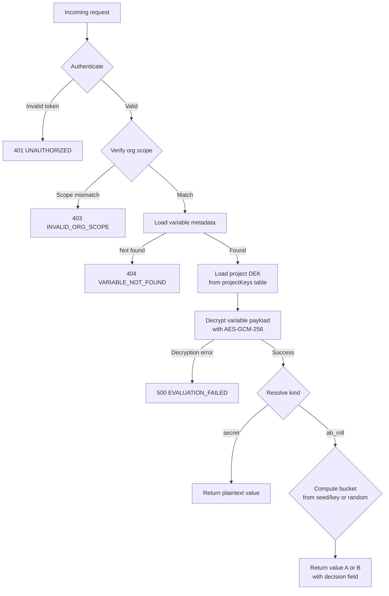

## The four-layer model

Every variable in Barekey exists at the bottom of a four-layer scope hierarchy:

```
org
└── project
    └── stage
        └── variable
```

<AccordionGroup>
  <Accordion title="Org">
    An org is a workspace that owns projects. Every Barekey account starts with a personal org named after you. Teams share an org, and billing is per-org. Org identity comes from Clerk — members are managed there.
  </Accordion>
  <Accordion title="Project">
    A project maps to one application or service. When you create a project, Barekey automatically provisions three stages: `development`, `staging`, and `production`. Each project gets its own data encryption key (DEK), meaning a compromise of one project's key does not affect any other project.
  </Accordion>
  <Accordion title="Stage">
    A stage is a named environment within a project. Stages are completely isolated — a variable set in `development` is a different row from the same-named variable in `production`. There is no automatic inheritance or promotion. You explicitly copy values between stages if you need to.
  </Accordion>
  <Accordion title="Variable">
    A variable is a named key–value pair that belongs to exactly one stage. It has a `kind` (`secret` or `ab_roll`), an optional `declaredType` (`string`, `boolean`, `int64`, `float`, `date`, `json`), and one or more encrypted values. The encrypted payload is stored in the database — plaintext is only produced at request time and is never persisted.
  </Accordion>
</AccordionGroup>

---

## Resolution flow

When your application calls the evaluate endpoint or the SDK's `env.get()`, Barekey runs this sequence:



The key constraint: **plaintext is only produced inside this handler and is returned in the response body**. It is not logged, not cached, and not written back to the database.

---

## Why orgs own projects (not users)

Individual users don't own projects. Only orgs do. This is a deliberate design decision:

- **Continuity** — if a user leaves a team, their projects don't disappear with them.
- **Access control** — org membership (managed in Clerk) determines who can read and write variables. There is no per-user ACL layer.
- **Billing** — usage is metered at the org level, which maps cleanly to a team or company.

When you sign up, Barekey creates a personal org for you (e.g. `jane-12345`). You can create additional orgs for team workspaces.

---

## What Barekey does and does not do

| Does | Does not |
|---|---|
| Encrypt variables at rest with AES-GCM-256 | Store plaintext values at any point |
| Issue short-lived access tokens for CLI/API use | Manage user permissions beyond org membership |
| Isolate variable values per project per stage | Automatically sync or promote between stages |
| Support deterministic A/B evaluation via seed | Replace a secrets manager for non-env-var workloads |
| Return metadata (kind, type, timestamps) separately from values | Support regex or wildcard variable lookups |
